## AutoEncoder with MNIST dataset

### Requirement
- python 3.6
- pytorch 0.4.1
- torchvision
- visdom
- numpy
- matplotlib

### Model preview

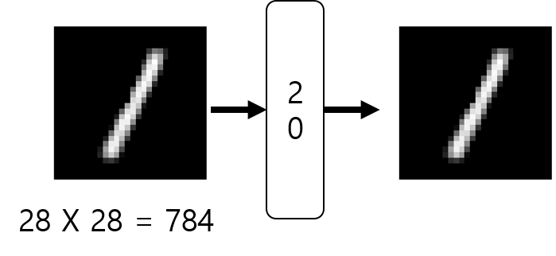

[GeneralAutoEncoer1](./General_AutoEncoder.ipynb)

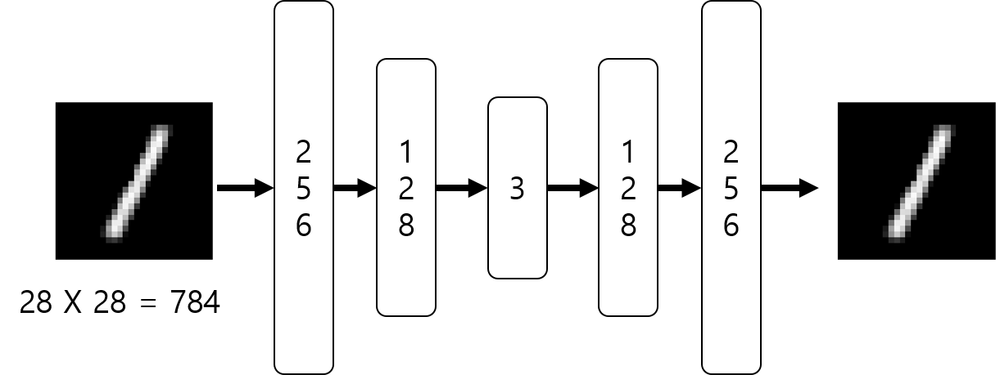

[GeneralAutoEncoer2](./General_AutoEncoder_vis.ipynb)

### MLP AutoEncoder result
#### simple model
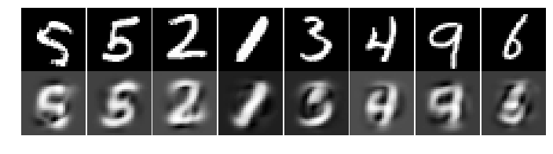
#### dimension reduction to 3d
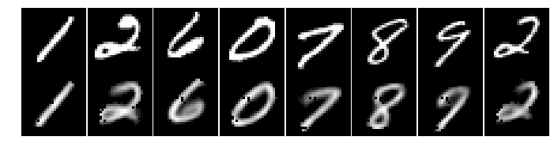
#### 3D scatter using matplotlib
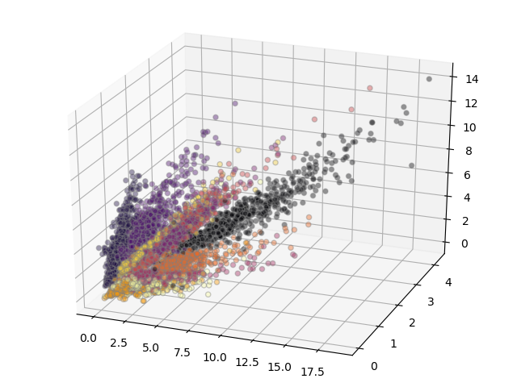
#### compare three axis (-0.5 ~ 0.5)
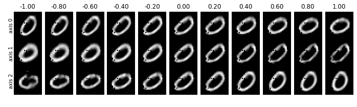
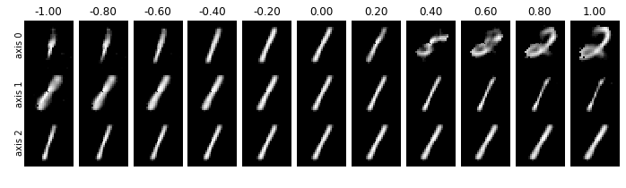
### Convolutional AutoEncoder result
#### simple model
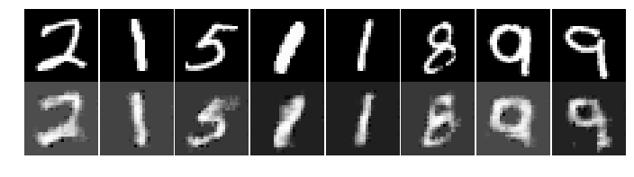
#### noise reduction
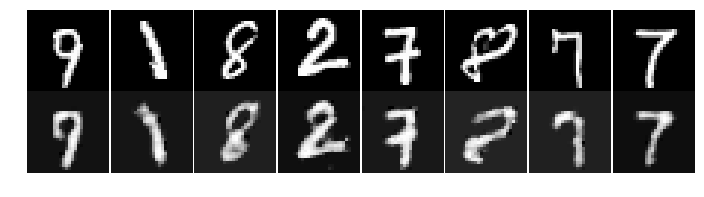
#### Filter comparison
simple model | noise reduction
--- | ---
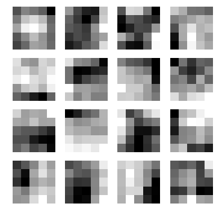 | 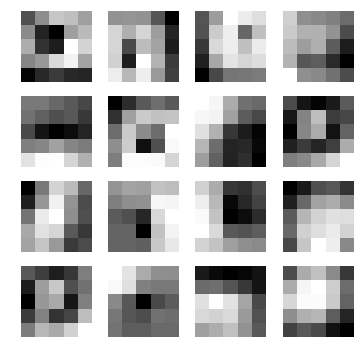
